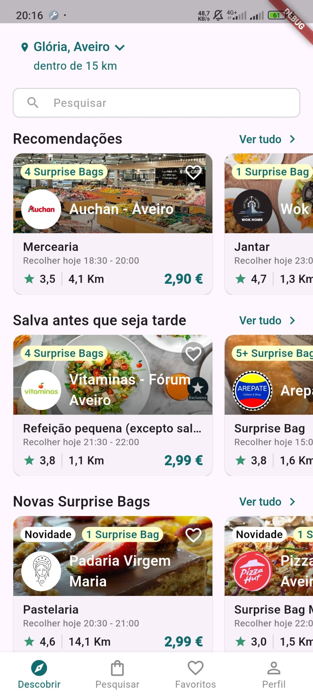
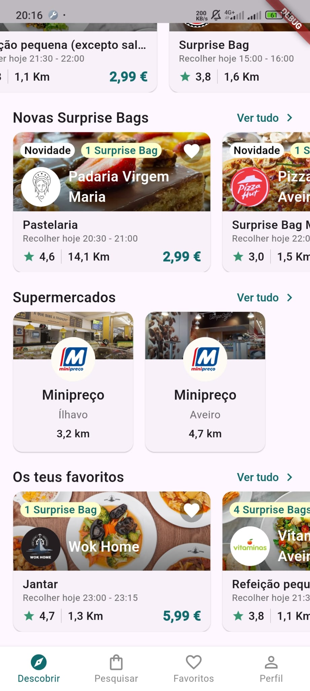

# too_good_to_go_clone

A Flutter project for the CM homework.

### Github Link
- [https://github.com/Migas77/homework_cm](https://github.com/Migas77/homework_cm)

### [Photos and Videos Showcasing the app](app_printscreens)
- HomeScreen
  - 
  - 

- Google Maps with clustering of markers (each marker has some address information and redirects to store page)
  - [Video](app_printscreens/google_maps_clustering.mp4)
  - [app_printscreens/google_maps_clustering_1.jpeg](app_printscreens/google_maps_clustering_1.jpeg)
  - [app_printscreens/google_maps_clustering_2.jpeg](app_printscreens/google_maps_clustering_2.jpeg)
  - [app_printscreens/google_maps_clustering_3.jpeg](app_printscreens/google_maps_clustering_3.jpeg)
  - [app_printscreens/google_maps_clustering_4.jpeg](app_printscreens/google_maps_clustering_4.jpeg)
  - [app_printscreens/google_maps_clustering_5.jpeg](app_printscreens/google_maps_clustering_5.jpeg)
  

- Horizontal view works for all pages
  - [app_printscreens/horizontal_view.jpeg](app_printscreens/horizontal_view.jpeg)

- Search Screen
  - [app_printscreens/search_screen.jpeg](app_printscreens/search_screen.jpeg)
  - [app_printscreens/search_screen_dropdown.jpeg](app_printscreens/search_screen_dropdown.jpeg)

- Store Page
  - [app_printscreens/store_page.jpeg](app_printscreens/store_page.jpeg)
  - [app_printscreens/store_page_2.jpeg](app_printscreens/store_page_2.jpeg)

- Favorites Page
  - [app_printscreens/favorites.jpeg](app_printscreens/favorites.jpeg)
  - [app_printscreens/favorites_with_stores.jpeg](app_printscreens/favorites_with_stores.jpeg)